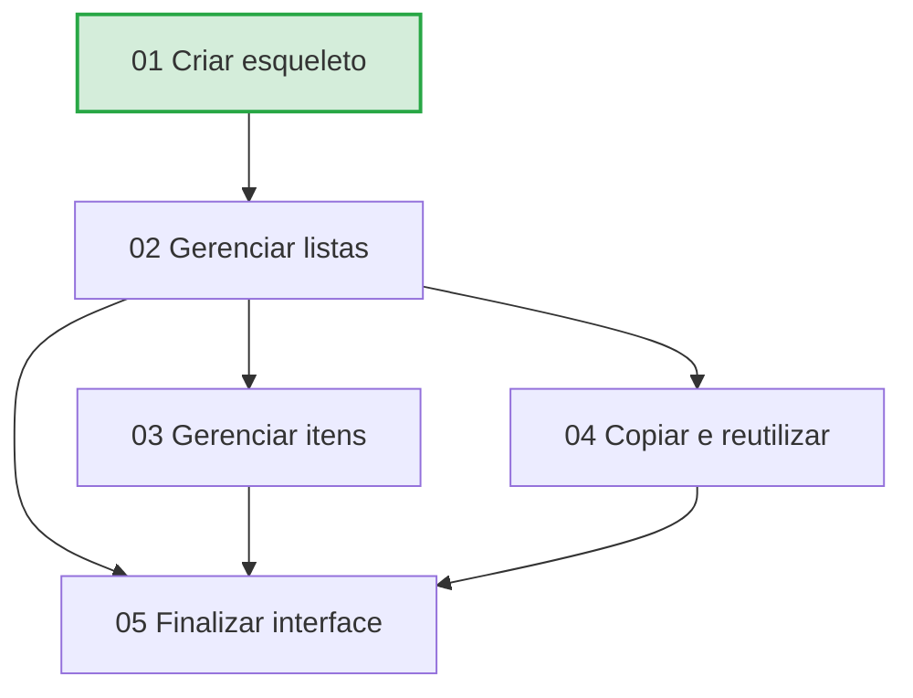

```mermaid
graph TD
  01["01 Criar esqueleto"]
  02["02 Gerenciar listas"]
  03["03 Gerenciar itens"]
  04["04 Copiar e reutilizar"]
  05["05 Finalizar interface"]

  01 --> 02
  02 --> 03
  02 --> 04
  02 --> 05
  03 --> 05
  04 --> 05

  classDef frontier fill:#d4edda,stroke:#28a745,stroke-width:2px
  class 01 frontier
```
